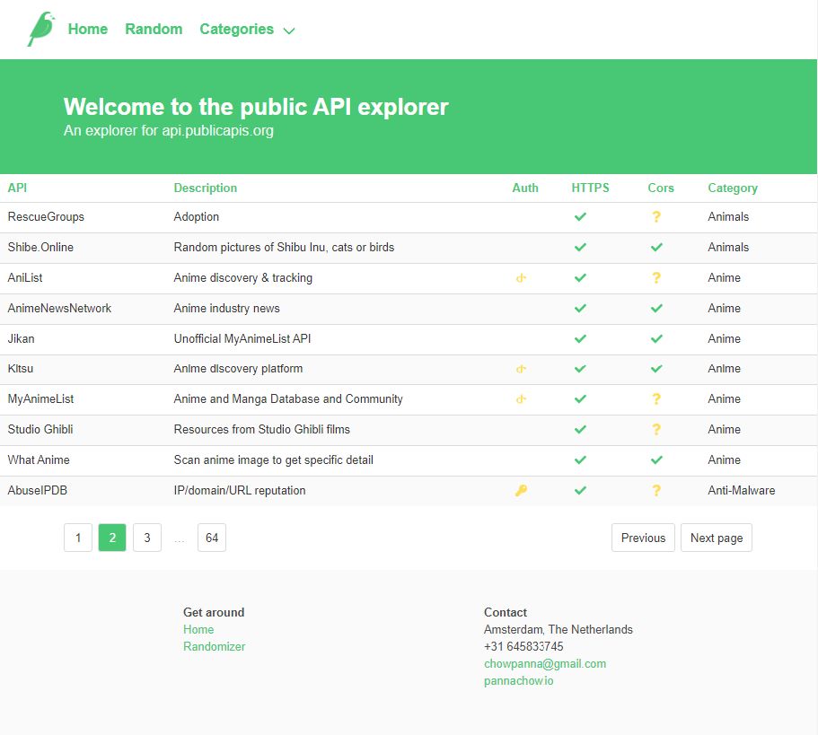

# public-api-explorer

An explorer for https://api.publicapis.org. Visit [https://pannachow.io/public-api-explorer](https://pannachow.io/public-api-explorer) for preview.



## Project setup
```
npm install
```

### Compiles and hot-reloads for development
```
npm run serve
```

### Compiles and minifies for production
```
npm run build
```

### Lints and fixes files
```
npm run lint
```

### Generates sitemap
```
npm run sitemap
```

### Customize configuration
See [Configuration Reference](https://cli.vuejs.org/config/).
